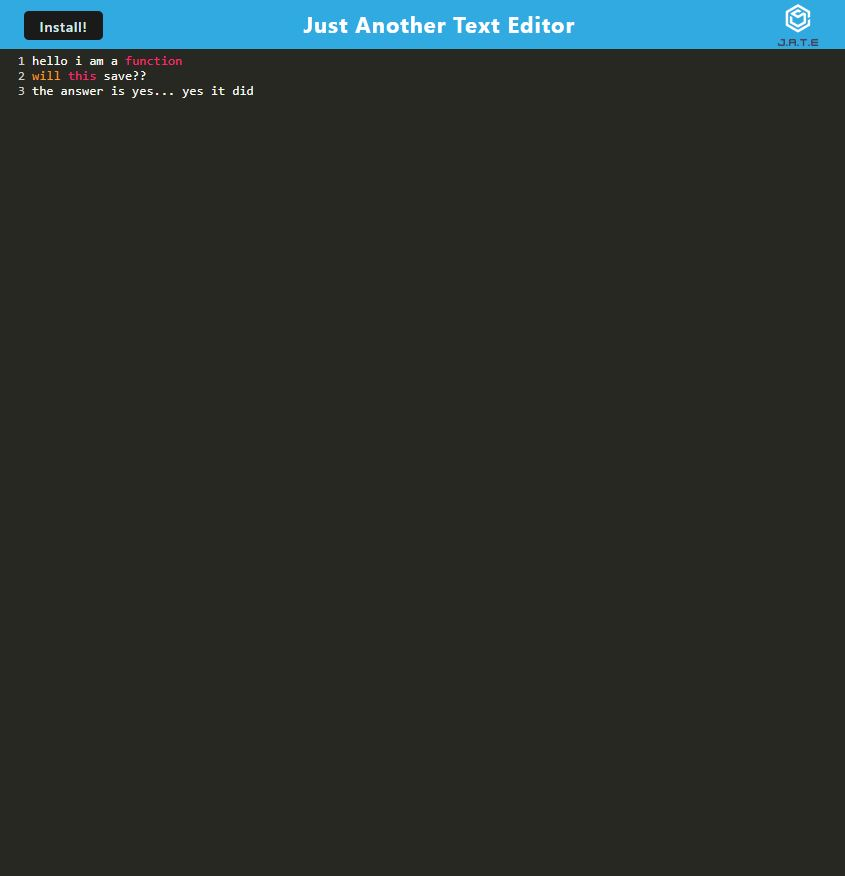

## <u>JATE Progressive Web App</u>

## Table of Contents
* [Description](#description)
* [Installtion](#installation)
* [Usage Info](#usage)
* [Contributions](#contributing)
* [Testing](#tests)
* [Questions](#questions)


## License description: (https://opensource.org/licenses/MIT)

## Description:
Just Another Text Editor allows the user to write and alter lines of code for easy access. It can be used in the browser or installed as a Progressive Web App. 




## Installation: 
To install the application locally, simply clone this repository and run the following commands.
```bash
npm i
```

```bash
npm run build
```

```bash
npm run start:dev
```


## Usage: 
If you'd like to use the deployed application please visit [here](https://jate-ct-app.herokuapp.com/)


## Contributions: 
Contributing is open to anyone!


## Questions:
If you have any questions please contact me at chris.tierney3@gmail.com or https://github.com/christierney3